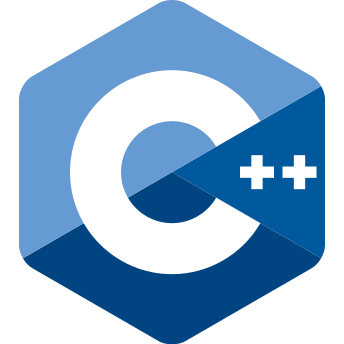
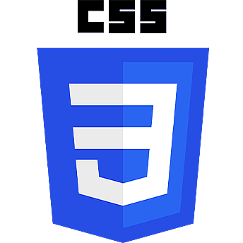
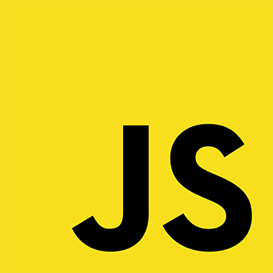

    <h1 align="center"><b>Hi, I'm ToxYc!</b></h1>

    <h3>I'm a beginner programmer, but passionate about coding. I'm constantly pushing my limits forward and trying to learn new technologies.</h3>

 

# Lenguages:

***
 
